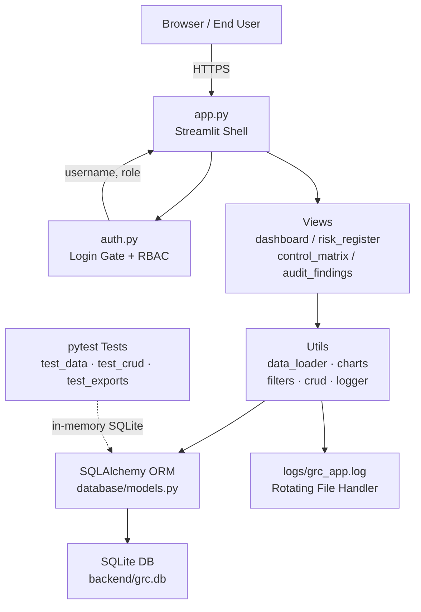

# GRC Audit Simulation Dashboard — Architecture

## Component Overview



## Data Flow

1. User opens the browser → `app.py` runs `login_gate()` from `auth.py`
2. `auth.py` queries the `users` table via SQLAlchemy, verifies bcrypt hash
3. On success, `(username, role)` stored in `st.session_state`
4. `app.py` loads dataframes via `data_loader.py` (SQLAlchemy → pandas)
5. Sidebar radio routes to the selected view module
6. View renders charts (Plotly), tables (styled pandas), and CRUD forms
7. On form submit, `crud.py` writes to DB + logs to `audit_log` table
8. `st.cache_data` is cleared to force fresh reads

## Role Hierarchy

| Role    | View Data | Add/Edit Records | Admin-only Actions |
|---------|-----------|------------------|--------------------|
| viewer  | Yes       | No               | No                 |
| auditor | Yes       | Yes              | No                 |
| admin   | Yes       | Yes              | Yes                |

## Directory Structure

```
grc-dashboard/
├── backend/
│   ├── data/                # Original CSVs (seed reference)
│   └── grc.db               # SQLite database (auto-created)
├── dashboard/
│   ├── app.py               # Streamlit main entry point
│   ├── auth.py              # Login gate + RBAC
│   ├── utils/
│   │   ├── data_loader.py   # DB → DataFrame loaders
│   │   ├── charts.py        # Plotly chart builders
│   │   ├── filters.py       # Sidebar filter widgets
│   │   ├── crud.py          # CRUD helpers (no Streamlit dep)
│   │   └── logger.py        # Rotating file logger
│   └── views/
│       ├── dashboard.py     # Executive dashboard
│       ├── risk_register.py # Risk register + CRUD
│       ├── control_matrix.py# Control matrix + CRUD
│       └── audit_findings.py# Audit findings + CRUD + PDF
├── database/
│   ├── models.py            # SQLAlchemy ORM models
│   ├── db.py                # Engine + session factory
│   └── seed.py              # Seed 40 risks/controls/findings
├── tests/
│   ├── conftest.py          # In-memory SQLite fixture
│   ├── test_data.py         # Model + integrity tests
│   ├── test_crud.py         # CRUD helper tests
│   └── test_exports.py      # PDF + Excel export tests
├── logs/                    # Runtime application logs
├── .github/workflows/ci.yml # GitHub Actions CI pipeline
├── Dockerfile               # Container build file
├── docker-compose.yml       # Local container orchestration
├── pyproject.toml           # Black + pytest config
├── .flake8                  # Flake8 linting config
└── requirements.txt         # Python dependencies
```
